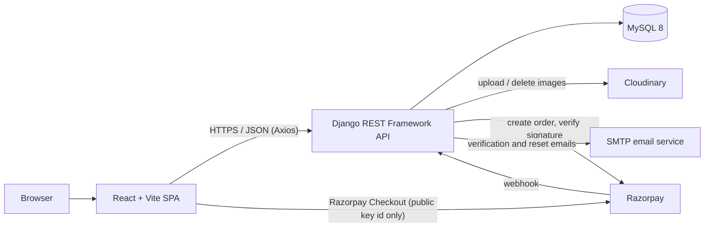
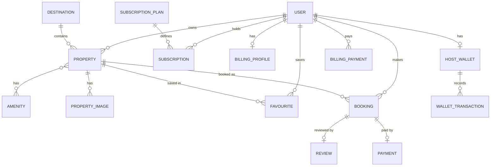
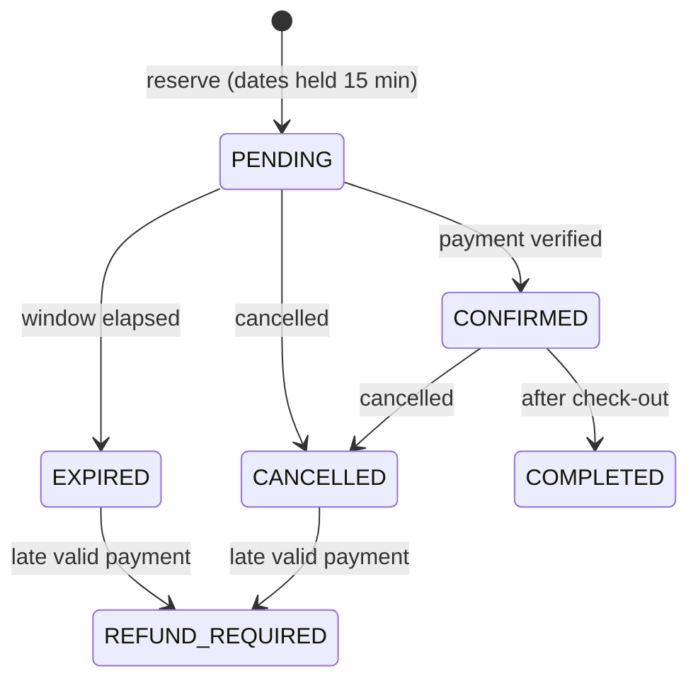

<div align="center">

# 🏡 Blüdhaven

**A full-stack vacation-rental marketplace for India: guests book stays, Hosts list homes under a subscription, and a Super Admin runs the platform.**


</div>

> **Status:** the application is feature-complete for the scope below and is covered by automated tests (see [Testing](#-testing)).
> Deployment to Render is **in progress** (see [Deployment](#-deployment)); no live demo link is published here yet.
> Razorpay, Cloudinary and the SMTP email service have been exercised in automated tests with fakes only; they still need a one-off check with real credentials after deployment.

---

## 📑 Table of contents

1. [Introduction](#-introduction)
2. [Key features](#-key-features)
3. [Technology stack](#-technology-stack)
4. [System architecture](#-system-architecture)
5. [Database schema](#-database-schema)
6. [API overview](#-api-overview)
7. [Engineering highlights](#-engineering-highlights)
8. [Project structure](#-project-structure)
9. [Local setup](#-local-setup)
10. [Environment variables](#-environment-variables)
11. [Deployment](#-deployment)
12. [Testing](#-testing)
13. [Limitations and future work](#-limitations-and-future-work)
14. [Conclusion and credits](#-conclusion-and-credits)

---

## 📖 Introduction

Blüdhaven is a single-platform marketplace for short-term stays in India. Guests search destinations and dates, pay online to confirm a booking, and review their stay. Hosts list properties, but only while they hold an active subscription plan whose limits the server enforces. A Super Admin manages users, destinations, plans, subscriptions and wallets.

**Who uses it**

| Role | What they do |
| --- | --- |
| `END_USER` (guest) | Browse, favourite, book and pay, cancel, review |
| `HOST` | Manage own properties and images, see own bookings, buy and manage a subscription plan, hold a wallet |
| `SUPER_ADMIN` | Manage everything on the platform |

The platform uses **one shared dataset with role-based access and Host ownership. It is not multi-tenant.** The brand, visual design and copy are original; the UX direction follows common vacation-rental patterns (destination/dates/guests search, property cards, filters, detail pages).

---

## ✨ Key features

### ✅ Implemented

<table>
<tr><th>Area</th><th>Features</th></tr>
<tr><td><b>Guest experience</b></td><td>Destination, date and guest search; server-side filtering and pagination; property detail pages with availability calendar; favourites; "My trips"; reviews on completed stays</td></tr>
<tr><td><b>Authentication</b></td><td>Registration, mandatory email verification, resend verification, login, logout, session restore, forgot/reset password, change password, profile edit; separate login portals for guests, Hosts and admins</td></tr>
<tr><td><b>Bookings and payments</b></td><td>Price quote, 15-minute date hold, Razorpay checkout, server-side payment verification plus webhook, cancellation, completion, automatic expiry of unpaid bookings</td></tr>
<tr><td><b>Host onboarding and listings</b></td><td>Host registration, draft and publish workflow, image upload with ordering and cover photo, amenity selection, Host booking list</td></tr>
<tr><td><b>Host subscriptions and billing</b></td><td>Trial / Standard / Premium / Ultimate plans, Razorpay purchase, prorated upgrades, scheduled downgrades, cancel and resume, renewal, wallet top-up, billing profile, payment history</td></tr>
<tr><td><b>Administration</b></td><td>Users (including inviting Hosts and sending password resets), properties, bookings, destinations, plans, subscriptions, wallets (with manual adjustments), billing profiles</td></tr>
<tr><td><b>Platform quality</b></td><td>Rate limiting, uniform error format, SEO tags with generated <code>sitemap.xml</code>/<code>robots.txt</code>, reduced-motion support, route-shaped loading skeletons, responsive layouts (light theme only)</td></tr>
</table>

### 🗺️ Not built (by design for now)

- Automatic refunds (refunds are manual in the Razorpay dashboard)
- Automatic recurring renewals (each renewal is a separate payment)
- Email notifications beyond verification, password reset and Host invitation

---

## 🧰 Technology stack

| Category | Technology | Role in this project |
| --- | --- | --- |
| **Frontend** | React 19, React Router 7 | Single-page app, role-guarded routes (UX only; the API enforces access) |
| | Vite 8 | Dev server and production build |
| | Tailwind CSS 4 (`@tailwindcss/vite`) | Styling with design tokens in `src/index.css` |
| | GSAP (+ `@gsap/react`), Lenis | Scroll reveals, page transitions, smooth scroll; skipped for reduced motion |
| | Axios | API client with token refresh handling |
| | lucide-react, Fontsource (Figtree, Pinyon Script) | Icons and self-hosted fonts |
| **Backend** | Django 5.2, Django REST Framework | REST API, ORM, admin site |
| | SimpleJWT | Access tokens and rotating refresh tokens with blacklist |
| | django-cors-headers | Cross-origin access for the frontend |
| | python-dotenv | Loads `backend/.env` |
| | Gunicorn, WhiteNoise | Production WSGI server and static files |
| **Database** | MySQL 8 via `mysqlclient` | All relational data |
| **Media** | Cloudinary | Property images (uploads are validated and re-encoded first) |
| **Payments** | Razorpay | Guest booking payments and Host subscription/wallet payments, as separate flows |
| **Email** | Django SMTP backend | Verification, password reset, Host invitation (console output in development) |
| **Deployment** | Render (Static Site + Web Service) | See [Deployment](#-deployment) |
| **Testing** | Django test runner, Vitest, Testing Library, axios-mock-adapter, ESLint 9 | Backend, frontend and lint checks |

---

## 🏗️ System architecture



- The two apps live in separate folders and deploy independently. React is never served from Django templates.
- Prices and payment outcomes are decided by the backend only. The browser receives the public Razorpay key id with each order; secret keys stay on the server.
- The refresh token lives in an httpOnly cookie; the access token is kept in memory.

Further diagrams (ERD, flowchart, UML, activity, state and data-flow diagrams) are in [`docs/diagrams`](docs/diagrams).

---

## 🗄️ Database schema

Django apps: `accounts`, `catalog`, `bookings`, `payments`, `billing`, `core`. Full diagram: [`docs/diagrams/ERD.svg`](docs/diagrams/ERD.svg).



| Model | Responsibility | Key fields |
| --- | --- | --- |
| **User** | Email-based account with a database-backed role | PK `id`, `email` (unique), `full_name`, `role`, `is_active`, `email_verified_at` |
| **Destination** | City/region used for search | PK `id`, `name`, `state`, `tagline`, `image_url`, `display_order` |
| **Amenity** | Property feature | PK `id`, `name`, `is_premium` |
| **Property** | A listing | PK `id`, FK `owner`→User, FK `destination`, `title`, `property_type`, `locality`, `postal_code`, `price_per_night`, `max_guests`, `bedrooms`, `bathrooms`, M2M `amenities`, `status` (`DRAFT`/`PUBLISHED`) |
| **PropertyImage** | Photo metadata (not the file) | PK `id`, FK `property`, `url`, `position` (0 = cover), `width`, `height`, `size_bytes`, `format`, `alt_text`; the storage key is kept server-side and never returned by the API |
| **Favourite** | Saved listing | PK `id`, FK `user`, FK `property` |
| **Booking** | A stay | PK `id`, FK `guest`→User, FK `property`, `check_in`, `check_out`, `guests_count`, `total_price`, `status`, `expires_at` |
| **Review** | Guest feedback | PK `id`, one-to-one `booking`, `rating` (1–5), `comment` |
| **Payment** | Guest booking payment | PK `id`, one-to-one `booking`, `razorpay_order_id`, `razorpay_payment_id`, `amount_paise`, `currency`, `status`, `verified_via`, `paid_at` |
| **SubscriptionPlan** | Host plan | PK `id`, `name`, `price`, `duration_days`, `features` (JSON: `max_properties`, `max_images_per_property`, `premium_amenities`), `is_active`, `is_trial`, `display_order` |
| **Subscription** | A Host's plan period | PK `id`, FK `user`, FK `plan`, `status`, `amount`, `payment_status`, `start_date`, `expiry_date`, `grace_until`, `cancel_at_period_end`, FK `previous_subscription` |
| **BillingProfile** | Host billing details | PK `id`, one-to-one `user` |
| **BillingPayment** | Host purchase or top-up | PK `id`, `purpose`, `kind`, FK `plan`, `price_paise`, `credit_paise`, `wallet_paise`, `amount_paise`, Razorpay ids, `status` |
| **HostWallet** | Credit balance | PK `id`, one-to-one `user`, `balance_paise` |
| **WalletTransaction** | Wallet ledger entry | PK `id`, FK `wallet`, FK `user`, `kind`, `amount_paise`, `balance_after_paise` |

Money for Host billing and payments is stored in **paise** (integers).

---

## 🔌 API overview

All routes are under `/api/`. Errors use one shape: `{"error": {"code", "message", "details"}}`. Lists are paginated (`?page=2&page_size=24`, default 12, max 100).

### Auth, under `/api/auth/`

| Method | Path | Purpose |
| --- | --- | --- |
| POST | `register/` | Register a guest (role is never accepted from the client) |
| POST | `register-host/` | Register a Host |
| POST | `verify-email/` · `resend-verification/` | Confirm or resend the verification email |
| POST | `token/` · `token/refresh/` · `token/blacklist/` | Login, refresh (cookie + CSRF), logout |
| POST | `password-reset/` · `password-reset/confirm/` | Forgot-password flow |
| GET | `csrf/` | Issue a CSRF token for refresh/logout |
| GET · PATCH | `me/` | Current user; PATCH changes `full_name` only |
| POST | `change-password/` | Change password (revokes all refresh tokens) |

### Catalog

| Method | Path | Purpose |
| --- | --- | --- |
| GET | `destinations/` · `amenities/` | Lookup data (public; Super Admin manages) |
| GET | `properties/` · `properties/{id}/` | Search and detail (filters, pagination) |
| POST · PATCH · DELETE | `properties/…` | Host/Admin management of own listings |
| GET | `properties/{id}/availability/` | Booked date ranges |
| POST | `properties/{id}/publish/` · `unpublish/` | Publish needs an active subscription and plan limits |
| GET · POST · DELETE | `properties/{id}/images/` (+ `reorder`) | Image upload, listing, ordering |
| GET · POST · DELETE | `favourites/` | Saved properties (any signed-in role) |

### Bookings, reviews and guest payments

| Method | Path | Purpose |
| --- | --- | --- |
| POST | `bookings/quote/` | Server-computed price |
| GET · POST · DELETE | `bookings/` | List own / create a `PENDING` booking (verified guest) / delete where permitted |
| POST | `bookings/{id}/cancel/` · `complete/` | Cancel (guest, Host, Admin) / complete (Host, Admin) |
| POST | `bookings/{id}/payment/` | Create the Razorpay order |
| POST | `bookings/{id}/payment/verify/` | Verify checkout signature and confirm |
| POST | `payments/razorpay/webhook/` | Razorpay webhook (signature checked) |
| GET · POST | `reviews/` | Read reviews / review a completed stay |

### Host billing (self-serve)

| Method | Path | Purpose |
| --- | --- | --- |
| GET | `plans/` | Public plan list |
| GET | `billing/wallet/` · `billing/wallet/transactions/` | Balance and ledger |
| POST | `billing/wallet/topup/` | Start a wallet top-up |
| POST | `billing/subscription/quote/` · `checkout/` | Price a purchase / create the Razorpay order |
| POST | `billing/subscription/cancel/` · `resume/` · `cancel-scheduled-change/` | Manage the current period |
| GET · POST | `billing/payments/` · `billing/payments/verify/` | History / verify a payment |
| GET · PUT · PATCH | `billing-profile/` | Own billing details (Host) |

### Administration (Super Admin)

| Method | Path | Purpose |
| --- | --- | --- |
| GET · POST · PATCH | `users/` | List, invite Hosts, update users |
| POST | `users/{id}/send-password-reset/` | Send a reset email |
| CRUD · GET/POST/PATCH | `plans/` · `subscriptions/` (+ `current`, `renew`) | Plans; subscription assignment and updates (`plans/` list is public, writes are Super Admin) |
| GET | `billing-profiles/` · `wallets/` · `wallet-transactions/` · `billing-payments/` | Read-only billing records |
| POST | `wallets/{user_id}/adjust/` | Manual wallet adjustment |

### Operations

| Method | Path | Purpose |
| --- | --- | --- |
| GET | `/api/health/` | Health check, returns `{"status":"ok"}` |

> The exact allowed methods per role are defined in each app's `views.py` and `permissions.py`; the tables above are an overview, not a replacement for them.

---

## ⚙️ Engineering highlights

### 1. Role-based access and separate portals

Roles live in the database and are enforced by DRF permission classes on every endpoint. The frontend hides routes for UX only (`RequireRole`), but never decides access. Guests, Hosts and admins have their own login pages (`/login`, `/host/login`, `/admin/login`) and panels (`/host/…`, `/admin/…`). Public sign-up creates only guests (`register/`) or Hosts (`register-host/`); a `role` field in the request is rejected. Super Admins are created on the server with `createsuperuser`.

### 2. Email verification

Registration sends a signed link (lifetime `EMAIL_VERIFICATION_TIMEOUT_HOURS`). Accounts must verify their email before they can log in (login returns 403 `email_not_verified` until then; Host-invited accounts are verified by opening their emailed link). Resend and password-reset requests are rate limited.

### 3. Booking and payment lifecycle



- A `PENDING` booking holds the dates for `BOOKING_PAYMENT_WINDOW_MINUTES` (15).
- `CONFIRMED` is reached **only** through a verified payment: signature, order, amount, currency, status and the time window are all checked server-side.
- A valid payment that arrives too late is kept, the booking becomes `REFUND_REQUIRED`, and an operator refunds it manually. There are no automatic refunds.
- `expire_unpaid_bookings` releases abandoned holds.

### 4. Razorpay verification and webhook

Payment can be confirmed by the browser's verify call **or** by Razorpay's webhook (events `payment.captured`, `order.paid`, `payment.failed`). Both paths use the same idempotent, row-locked settlement code, so a double delivery cannot double-apply a payment.

### 5. Host entitlements and limits

A Host is entitled when their subscription is `ACTIVE`/`TRIAL` within its dates, or `PAST_DUE` within `SUBSCRIPTION_GRACE_DAYS`. Entitlement is decided by date, so a missed cron run never extends access. Publishing requires entitlement, the plan's `max_properties`, `max_images_per_property` and permission for premium amenities. Drafts are capped separately (`MAX_DRAFTS_PER_HOST`, `DRAFT_MAX_IMAGES`).

### 6. Prorated upgrades, scheduled downgrades, wallet

1. The Host asks for a **quote**; the server computes the price.
2. **Checkout** creates a Razorpay order; the wallet is used first.
3. On verified payment, a new, trial or plan-change purchase starts today. A change ends the current period and credits the unused portion to the wallet pro rata.
4. A downgrade is **scheduled for the end of the current period** and can be cancelled before then.
5. A renewal queues the next period after the current one.
6. A valid payment that cannot be applied becomes `REFUND_REQUIRED` for manual refund.

Guest booking payments and Host billing never share orders, endpoints or permissions.

### 7. Security measures

- Refresh token only in an httpOnly cookie (`bludhaven_refresh`, path `/api/auth/`), with CSRF protection for refresh and logout; refresh tokens rotate and are blacklisted on logout and password change.
- Throttling per scope (`THROTTLE_*`) for login, registration, password reset, refresh, uploads and payments.
- Image uploads are checked by content, size and pixel count, then re-encoded; stored under a per-Host/property folder with a random name. Storage keys are never exposed by the API.
- With `DJANGO_DEBUG` off: a real secret key and allowed hosts are mandatory, and HTTPS redirect, secure cookies and HSTS are enabled.
- Secrets only come from environment variables; `.env` files are git-ignored.

---

## 🗂️ Project structure

```text
bludhaven/
├── backend/
│   ├── manage.py
│   ├── requirements.txt
│   ├── .env.example
│   ├── config/            settings, root URLs, WSGI/ASGI
│   └── apps/
│       ├── accounts/      users, auth, RBAC, emails, admin user management
│       ├── catalog/       destinations, amenities, properties, images, favourites
│       ├── bookings/      bookings, availability, reviews, status workflow
│       ├── payments/      Razorpay order, verify and webhook for bookings
│       ├── billing/       plans, subscriptions, wallet, purchases, limits
│       └── core/          health check
├── frontend/
│   ├── .env.example
│   ├── package.json
│   ├── vite.config.js
│   ├── scripts/           SEO plugin, optional image fetch script
│   └── src/
│       ├── pages/         public, host/ and admin/ screens
│       ├── components/    UI, booking, host, admin, plans, reviews
│       ├── layouts/       Main, Auth, Host, Admin shells
│       ├── services/      Axios instance and API modules
│       ├── context/       auth and favourites providers
│       ├── hooks/         data, payment and motion hooks
│       ├── utils/ config/ data/ assets/ test/
│       └── App.jsx        route table
├── docs/diagrams/         ERD, flowchart, UML, activity, state and DFD SVGs
├── README.md
└── .gitignore
```

---

## 🚀 Local setup

**1. Prerequisites:** Python 3.11 and Node.js 22 with npm (the versions this project was developed and tested with), MySQL 8 running locally. On Debian/Ubuntu, `mysqlclient` needs `libmysqlclient-dev`, `pkg-config` and `build-essential`.

**2. Clone**

```bash
git clone <your-repository-url> bludhaven
cd bludhaven
```

**3. Create the MySQL database and user** (use your own name and password)

```sql
CREATE DATABASE bludhaven CHARACTER SET utf8mb4;
CREATE USER 'bludhaven'@'localhost' IDENTIFIED BY '<choose-a-password>';
GRANT ALL PRIVILEGES ON bludhaven.* TO 'bludhaven'@'localhost';
```

The test runner also creates a temporary `test_…` database, so this user needs privileges for it too (or use a user that can create databases locally).

**4. Backend dependencies**

```bash
cd backend
python3 -m venv .venv
source .venv/bin/activate        # Windows: .venv\Scripts\activate
pip install -r requirements.txt
```

**5. Backend environment**

```bash
cp .env.example .env             # then set DB_NAME, DB_USER, DB_PASSWORD and DJANGO_DEBUG=True
```

**6. Migrate and seed**

```bash
python manage.py migrate
python manage.py createsuperuser                   # first Super Admin
python manage.py seed_host_plans                   # Trial / Standard / Premium / Ultimate
python manage.py seed_demo_data --accounts         # optional, DEBUG only: demo catalog and accounts
```

**7. 🖥️ Terminal 1: start Django** → <http://localhost:8000>

```bash
python manage.py runserver
```

**8. Frontend dependencies** (🖥️ Terminal 2)

```bash
cd frontend
npm install
```

**9. Frontend API URL**

```bash
cp .env.example .env             # VITE_API_BASE_URL defaults to http://localhost:8000
```

**10. 🖥️ Terminal 2: start Vite** → <http://localhost:5173>

```bash
npm run dev
```

In development, verification and reset emails are printed in the `runserver` console. Image uploads return 503 until `CLOUDINARY_URL` is set, and payments need Razorpay test keys.

---

## 🔐 Environment variables

Copy the examples and fill in your own values. **Never commit real values.**

- Backend: [`backend/.env.example`](backend/.env.example)
- Frontend: [`frontend/.env.example`](frontend/.env.example)

### Backend (`backend/.env`)

| Variable | Purpose |
| --- | --- |
| `DJANGO_SECRET_KEY`, `DJANGO_DEBUG`, `DJANGO_ALLOWED_HOSTS` | Core Django settings. With debug off, a real secret key and hosts are required |
| `DB_NAME`, `DB_USER`, `DB_PASSWORD` | MySQL credentials (required) |
| `DB_HOST`, `DB_PORT`, `DB_SSL_CA` | MySQL location (defaults `127.0.0.1`, `3306`) and optional CA file for TLS |
| `CORS_ALLOWED_ORIGINS`, `CSRF_TRUSTED_ORIGINS`, `FRONTEND_URL` | Frontend origin(s) and the base URL used in email links |
| `DJANGO_BEHIND_PROXY`, `NUM_PROXIES`, `DJANGO_SECURE_SSL_REDIRECT`, `DJANGO_HSTS_SECONDS`, `DJANGO_HSTS_INCLUDE_SUBDOMAINS` | HTTPS and reverse-proxy behaviour |
| `JWT_ACCESS_TOKEN_MINUTES`, `JWT_REFRESH_TOKEN_DAYS`, `JWT_SIGNING_KEY` | Token lifetimes and optional separate signing key |
| `REFRESH_COOKIE_NAME`, `REFRESH_COOKIE_SECURE`, `REFRESH_COOKIE_SAMESITE`, `REFRESH_COOKIE_DOMAIN` | Refresh-token cookie |
| `THROTTLE_ANON`, `THROTTLE_USER`, `THROTTLE_AUTH`, `THROTTLE_REGISTER`, `THROTTLE_PASSWORD_RESET`, `THROTTLE_RESEND_VERIFICATION`, `THROTTLE_PAYMENT`, `THROTTLE_REFRESH`, `THROTTLE_LOGOUT`, `THROTTLE_PASSWORD_CHANGE`, `THROTTLE_UPLOAD` | Rate limits |
| `EMAIL_BACKEND`, `EMAIL_HOST`, `EMAIL_PORT`, `EMAIL_HOST_USER`, `EMAIL_HOST_PASSWORD`, `EMAIL_USE_TLS`, `DEFAULT_FROM_EMAIL` | Outgoing email |
| `PASSWORD_RESET_TIMEOUT_MINUTES`, `EMAIL_VERIFICATION_TIMEOUT_HOURS` | Link lifetimes |
| `CLOUDINARY_URL`, `CLOUDINARY_ROOT_FOLDER` | Image storage |
| `IMAGE_MAX_BYTES`, `IMAGE_MAX_PIXELS`, `IMAGE_ALLOWED_FORMATS` | Upload validation |
| `RAZORPAY_KEY_ID`, `RAZORPAY_KEY_SECRET`, `RAZORPAY_WEBHOOK_SECRET` | Razorpay (secrets are backend-only) |
| `BOOKING_PAYMENT_WINDOW_MINUTES`, `BOOKING_MAX_NIGHTS`, `SUBSCRIPTION_GRACE_DAYS`, `WALLET_TOPUP_MAX_RUPEES` | Business rules |
| `MAX_DRAFTS_PER_HOST`, `DRAFT_MAX_IMAGES`, `LOG_LEVEL` | Draft caps and logging |

### Frontend (`frontend/.env`)

| Variable | Purpose |
| --- | --- |
| `VITE_API_BASE_URL` | API address. **Required for production builds** (the build stops without it) |
| `VITE_SITE_URL` | Public site address for canonical URLs, `sitemap.xml`, `robots.txt` |
| `PEXELS_API_KEY` | Only for the optional `npm run images` script; never bundled into the site |

---

## ☁️ Deployment

> **Status: in progress.** The backend Web Service and frontend Static Site are configured on Render, and an external MySQL database (Aiven, TLS through `DB_SSL_CA`) is being connected. A production deployment has **not** been verified end to end, so no live URL is listed.

| Part | Platform | Settings |
| --- | --- | --- |
| Frontend | Render Static Site | Root `frontend` · build `npm install && npm run build` · publish `dist` · rewrite `/*` → `/index.html` · set `VITE_API_BASE_URL` and `VITE_SITE_URL` before building |
| Backend | Render Web Service | Root `backend` · build `pip install -r requirements.txt && python manage.py collectstatic --noinput` · start `python manage.py migrate --noinput && gunicorn config.wsgi:application --bind 0.0.0.0:$PORT` · health check `/api/health/` |
| Database | External MySQL 8 | `DB_*` variables; `DB_SSL_CA` pointing at a Render Secret File if TLS is required |
| Media | Cloudinary | `CLOUDINARY_URL` |
| Payments | Razorpay | `RAZORPAY_*`; webhook URL `https://<api-host>/api/payments/razorpay/webhook/` |

Required backend settings in production: `DJANGO_DEBUG=False`, `DJANGO_SECRET_KEY`, `DJANGO_ALLOWED_HOSTS`, `DJANGO_BEHIND_PROXY=True`, `FRONTEND_URL` (https), `CORS_ALLOWED_ORIGINS`, `CSRF_TRUSTED_ORIGINS`, the `DB_*` variables, the `EMAIL_*` variables and the Cloudinary and Razorpay variables.

After the first deploy:

1. `python manage.py seed_host_plans`: creates the four Host plans (review prices in the admin panel).
2. `python manage.py check_storage`: uploads, reads back and deletes a test image to prove the real Cloudinary credentials work.
3. Schedule `python manage.py expire_subscriptions` and `python manage.py expire_unpaid_bookings` daily (for example as Render Cron Jobs).
4. `seed_demo_data` refuses to run unless `DJANGO_DEBUG` is on; to load demo content into a hosted database, run it from your own machine pointed at that database.

---

## 🧪 Testing

| Check | Command | Result of the latest run (2026-10-09) |
| --- | --- | --- |
| Backend tests | `cd backend && python manage.py test` | 620 tests, OK |
| Frontend tests | `cd frontend && npm test` | 27 files, 220 tests passed |
| Lint | `cd frontend && npm run lint` | No errors |
| Production build | `cd frontend && VITE_API_BASE_URL=https://api.example.com npm run build` | Built successfully |

Backend tests need a running MySQL server and cover authentication, RBAC, email flows, bookings, availability, the payment window, payment settlement, concurrency, subscriptions and wallet behaviour. Frontend tests cover routing, auth, listings, booking, plans and admin screens.

Razorpay, Cloudinary and SMTP are replaced by fakes in automated tests. Counts above come from the most recent run and will change as tests are added.

---

## 🔭 Limitations and future work

**Known limitations**

- No automatic refunds: late or inapplicable payments are flagged `REFUND_REQUIRED` and refunded manually.
- No automatic recurring renewals: each renewal is its own payment.
- The app is client-rendered; link previews use the defaults in `index.html`.
- Real Razorpay, Cloudinary and SMTP integrations are unverified until tested with real credentials after deployment.

**Possible next steps**

- Automated refunds and recurring billing
- Booking confirmation and reminder emails
- Server-side rendering or prerendering for per-page link previews

---

## 🎓 Conclusion and credits

Blüdhaven is a complete, test-covered example of a role-based marketplace with real payment handling: a React SPA over a Django REST API, with idempotent payment settlement, subscription entitlements, a wallet and defence-in-depth security. It demonstrates full-stack API design, relational modelling, concurrency-safe business rules and automated testing.

**Credits:** built with React, Vite, Tailwind CSS, GSAP, Django, Django REST Framework, MySQL, Cloudinary and Razorpay. Icons by [Lucide](https://lucide.dev). Photography is supplied by the project owner; if the optional `npm run images` script is used, photos come from [Pexels](https://www.pexels.com) and must be credited as their guidelines require.
